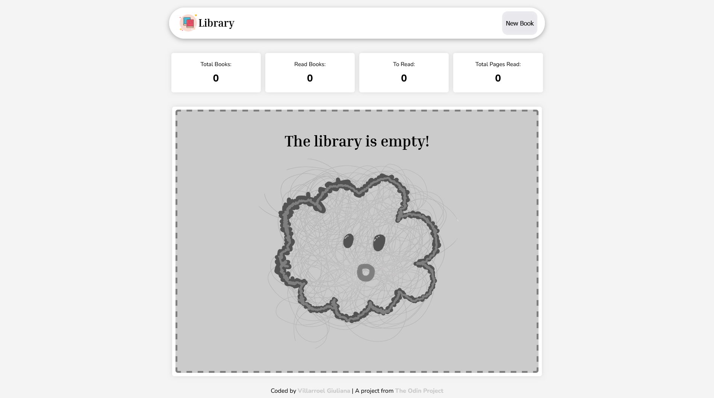
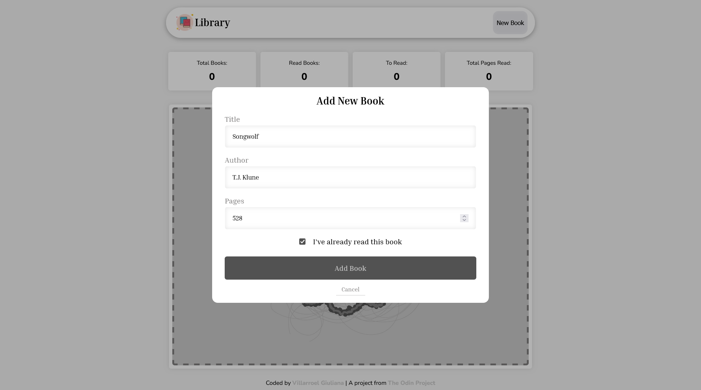

# 📚 Library Management App

[](https://opensource.org/licenses/MIT)

A simple and intuitive web application to manage your personal book collection. Built with vanilla JavaScript, HTML, and CSS as part of [The Odin Project](https://www.theodinproject.com) curriculum.




## ✨ Features

-   **Add Books**: Create new book entries with title, author, page count, and read status
-   **Toggle Read Status**: Mark books as read or unread with a single click
-   **Remove Books**: Delete books from your library
-   **Live Statistics**: Track total books, read books, pending books, and total pages read
-   **Responsive Design**: Works seamlessly on desktop and mobile devices
-   **Dynamic Empty State**: Displays a friendly illustration when library is empty

## 🚀 Demo

[Live Demo Link](https://gvillarroel-dev.github.io/library/)

## 🛠️ Technologies Used

-   **HTML5**: Semantic markup
-   **CSS3**: Custom properties, Flexbox, Grid
-   **JavaScript (ES6+)**: DOM manipulation, Constructor functions, Prototypes

## 📂 Project Structure

```
library/
├── index.html          # Main HTML structure
├── css/
│   └── styles.css      # All styling and responsive design
├── js/
│   └── script.js       # Application logic and DOM manipulation
├── img/
│    ├── books.png       # Header logo icon
│    ├── illustration.png # Empty state illustration
│    ├── library-preview.png # Preview Image
│    └── library-previrew2.png
├── README.md
└── LICENCE
```

## 💻 How It Works

### Core Functionality

1. **Book Constructor**

    ```javascript
    function Book(title, author, numberOfPages, read) {
    	this.id = crypto.randomUUID();
    	this.title = title;
    	this.author = author;
    	this.numberOfPages = numberOfPages;
    	this.read = read || false;
    }
    ```

    - Creates book objects with unique IDs
    - Stores book information in the `myLibrary` array

2. **Adding Books**

    - User clicks "New Book" button to open modal
    - Form validates all required fields
    - On successful validation, creates new `Book` instance
    - Updates library display and statistics

3. **Dynamic Rendering**

    - `updateLibrary()` clears and re-renders the entire library
    - Shows empty state when no books exist
    - Creates book cards dynamically for each book in the array

4. **Read Status Toggle**

    - Each book has a prototype method `toggleRead()`
    - Clicking the status button toggles between "Read" and "Not Read"
    - Updates statistics in real-time

5. **Remove Books**
    - Finds book by unique ID in the array
    - Removes from `myLibrary` array
    - Re-renders library and updates stats

### Key Functions

-   `addBookToLibrary()` - Validates form and creates new book
-   `removeBook(bookId)` - Deletes book from library
-   `toggleBookRead(bookId)` - Changes read status
-   `updateLibrary()` - Renders all books or empty state
-   `updateStats()` - Calculates and displays library statistics
-   `createBookCard(book)` - Generates DOM elements for each book
-   `createEmptyState()` - Creates empty library illustration

## 🎨 Design Features

-   **Custom CSS Variables**: Centralized color and font management
-   **Responsive Grid**: Auto-fit layout adapts to screen size
-   **Color-Coded Buttons**:
    -   🟢 Green: Read books
    -   🔵 Blue: Not read books
    -   🔴 Red: Remove action
-   **Smooth Transitions**: Hover effects and animations
-   **Modal Overlay**: Centered form with backdrop blur effect

## 🚦 Getting Started

1. Clone the repository:

    ```bash
    git clone https://github.com/gvillarroel-dev/library.git
    ```

2. Navigate to project directory:

    ```bash
    cd library
    ```

3. Open `index.html` in your browser:
    ```bash
    open index.html
    ```
    Or use a local server like Live Server in VS Code.

## 📝 Usage

1. **Add a Book**:

    - Click "New Book" button in header
    - Fill in title, author, and number of pages
    - Check "I've already read this book" if applicable
    - Click "Add Book"

2. **Toggle Read Status**:

    - Click the "Read" or "Not Read" button on any book card

3. **Remove a Book**:

    - Click the "Remove" button on the book card you want to delete

4. **View Statistics**:
    - Statistics update automatically at the top of the library

## 🎯 Future Enhancements

-   [ ] Local storage persistence
-   [ ] Search and filter books
-   [ ] Sort by title, author, or read status
-   [ ] Book cover images

## 🙏 Credits

-   **Project**: Part of [The Odin Project](https://www.theodinproject.com) curriculum
-   **UI/UX Design**: Created by [Villarroel Giuliana](https://github.com/gvillarroel-dev), inspired by modern design trends and the design community
-   **Logo Icon**: [Books icon](https://icons8.com/icon/113798/books) by [Icons8](https://icons8.com)
-   **Empty State Illustration**: Drawn by [Villarroel Giuliana](https://github.com/gvillarroel-dev)
-   **Fonts**:
    -   [Nunito](https://fonts.google.com/specimen/Nunito) by Vernon Adams
    -   [Inria Serif](https://fonts.google.com/specimen/Inria+Serif) by Black Foundry

## 👩‍💻 Author

**Villarroel Giuliana**

-   GitHub: [@gvillarroel-dev](https://github.com/gvillarroel-dev)
-   Project: [The Odin Project - Library](https://www.theodinproject.com/lessons/node-path-javascript-library)

## 📄 License

This project is open source and available under the [MIT License](LICENSE).

---

Made with 🧡 as part of The Odin Project journey
