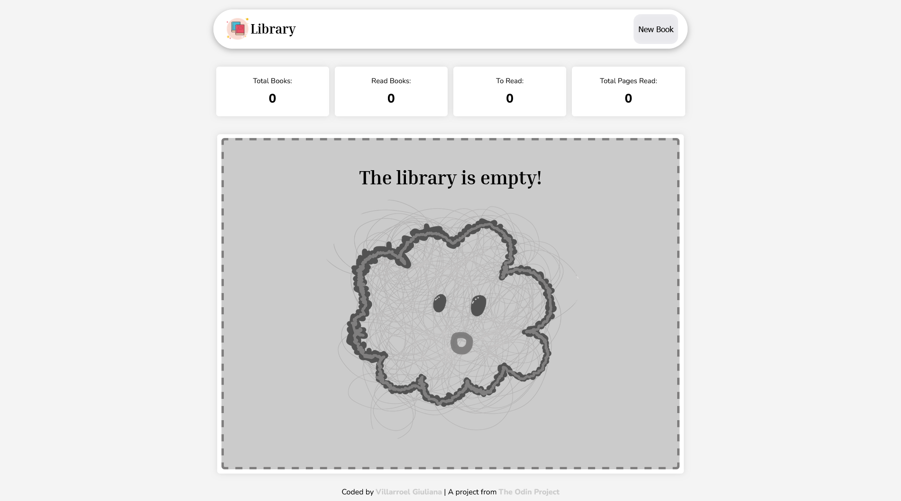
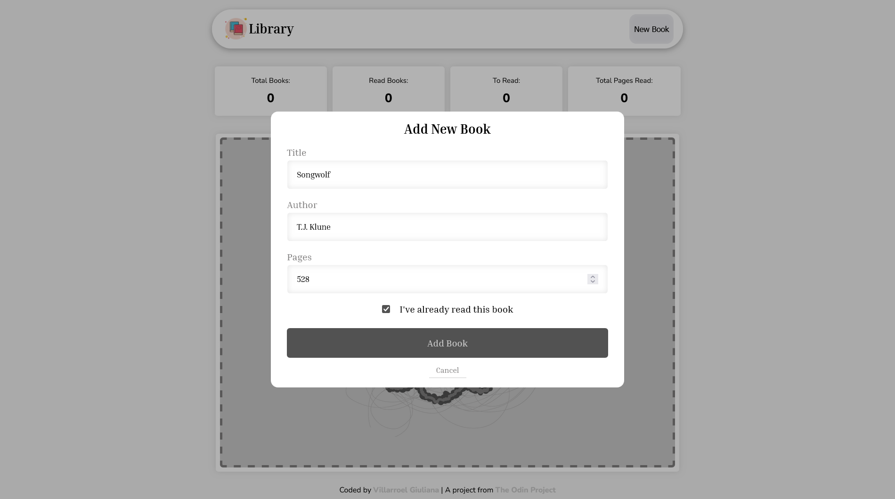
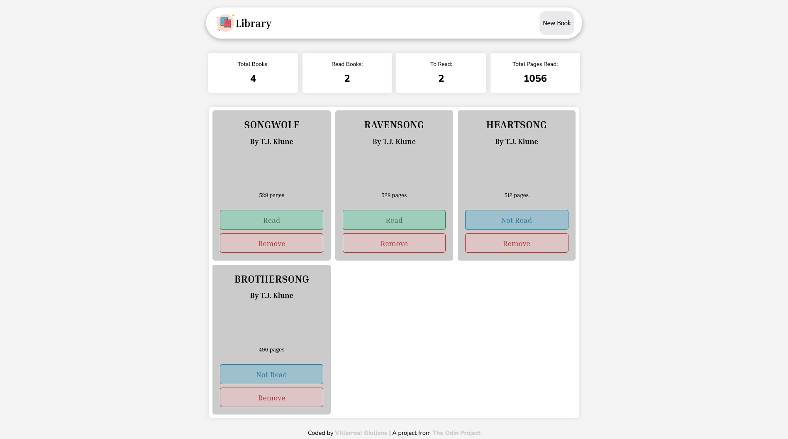

# 📚 Library Management App

[](https://opensource.org/licenses/MIT)

A simple and intuitive web application to manage your personal book collection. Built with vanilla JavaScript ES6+ classes, HTML, and CSS as part of [The Odin Project](https://www.theodinproject.com) curriculum.





## ✨ Features

- **Add Books**: Create new book entries with title, author, page count, and read status
- **Toggle Read Status**: Mark books as read or unread with a single click
- **Remove Books**: Delete books from your library
- **Live Statistics**: Track total books, read books, pending books, and total pages read
- **Responsive Design**: Works seamlessly on desktop and mobile devices
- **Dynamic Empty State**: Displays a friendly illustration when library is empty

## 🚀 Demo

[Live Demo Link](https://gvillarroel-dev.github.io/library/)

## 🛠️ Technologies Used

- **HTML5**: Semantic markup
- **CSS3**: Custom properties, Flexbox, Grid
- **JavaScript (ES6+)**: Classes, DOM manipulation, Dependency Injection

## 📂 Project Structure

```
library/
├── index.html          # Main HTML structure
├── css/
│   └── styles.css      # All styling and responsive design
├── js/
│   └── script.js       # Application logic with ES6 classes
├── img/
│    ├── books.png       # Header logo icon
│    ├── illustration.png # Empty state illustration
│    ├── library-preview.png # Preview Image
│    ├── library-preview2.png
│    └── library-preview3.png
├── README.md
└── LICENCE
```

## 💻 How It Works

### Architecture

The application uses a **class-based architecture** with separation of concerns:

- **`Book`**: Represents individual book data and behavior
- **`Library`**: Manages the book collection and business logic
- **`LibraryUI`**: Handles all DOM manipulation and user interactions

### Core Classes

1. **Book Class**

```javascript
class Book {
	constructor(title, author, numberOfPages, read) {
		this.id = crypto.randomUUID();
		this.title = title;
		this.author = author;
		this.numberOfPages = numberOfPages;
		this.read = read;
	}

	toggleRead() {
		this.read = !this.read;
	}
}
```

    - Creates book objects with unique IDs
    - Encapsulates book data and toggle behavior

2. **Library Class**

```javascript
    class Library {
        constructor() {
            this.books = [];
        }

        addBookToLibrary(title, author, numberOfPages, read) { ... }
        removeBook(bookId) { ... }
        toggleBookRead(bookId) { ... }
        updateStats() { ... }
        getBooks() { ... }
    }
```

    - Manages the book collection
    - Handles business logic (add, remove, toggle, statistics)
    - Returns success/failure status for operations

3. **LibraryUI Class**

```javascript
    class LibraryUI {
        constructor(library) {
            this.library = library;
            // DOM element references
            // ...
            this.initEventListeners();
        }

        handleAddBook() { ... }
        handleRemoveBook(bookId) { ... }
        handleToggleRead(bookId) { ... }
        updateStats() { ... }
        createBookCard(book) { ... }
        createEmptyState() { ... }
        updateLibrary() { ... }
        initEventListeners() { ... }
    }
```

    - Manages all DOM interactions
    - Receives `Library` instance via dependency injection
    - Delegates data operations to `Library` class
    - Updates UI based on `Library` responses

### Application Flow

1. **Initialization**

```javascript
const library = new Library();
const UI = new LibraryUI(library);
UI.updateLibrary();
```

2. **Adding Books**
    - User fills form and clicks "Add Book"
    - `LibraryUI.handleAddBook()` collects form data
    - Calls `library.addBookToLibrary()` with validated data
    - If successful, updates UI and closes modal
    - If validation fails, shows error alert

3. **Dynamic Rendering**
    - `UI.updateLibrary()` fetches books via `library.getBooks()`
    - Clears and re-renders the entire library container
    - Shows empty state when no books exist
    - Creates book cards dynamically for each book

4. **Read Status Toggle**
    - User clicks status button on book card
    - `UI.handleToggleRead(bookId)` calls `library.toggleBookRead(bookId)`
    - `Book.toggleRead()` method updates the read property
    - UI re-renders to reflect changes

5. **Statistics Updates**
    - `UI.updateStats()` calls `library.updateStats()`
    - Returns object: `{ totalBooks, readBooks, pendingBooks, pagesRead }`
    - Updates DOM elements with calculated statistics

### Key Methods

**Library Class:**

- `addBookToLibrary(title, author, pages, read)` - Validates and creates new book
- `removeBook(bookId)` - Deletes book from collection
- `toggleBookRead(bookId)` - Changes read status
- `updateStats()` - Calculates statistics and returns object
- `getBooks()` - Returns copy of books array

**LibraryUI Class:**

- `handleAddBook()` - Processes form submission
- `handleRemoveBook(bookId)` - Handles book deletion
- `handleToggleRead(bookId)` - Handles status toggle
- `updateLibrary()` - Renders all books or empty state
- `updateStats()` - Syncs statistics with DOM
- `createBookCard(book)` - Generates DOM elements for each book
- `createEmptyState()` - Creates empty library illustration
- `initEventListeners()` - Sets up all event handlers

## 🎨 Design Features

- **Custom CSS Variables**: Centralized color and font management
- **Responsive Grid**: Auto-fit layout adapts to screen size
- **Color-Coded Buttons**:
    - 🟢 Green: Read books
    - 🔵 Blue: Not read books
    - 🔴 Red: Remove action
- **Smooth Transitions**: Hover effects and animations
- **Modal Overlay**: Centered form with backdrop blur effect

## 🚦 Getting Started

1. Clone the repository:

```bash
    git clone https://github.com/gvillarroel-dev/library.git
```

2. Navigate to project directory:

```bash
    cd library
```

3. Open `index.html` in your browser:

```bash
    open index.html
```

    Or use a local server like Live Server in VS Code.

## 📝 Usage

1. **Add a Book**:
    - Click "New Book" button in header
    - Fill in title, author, and number of pages
    - Check "I've already read this book" if applicable
    - Click "Add Book"

2. **Toggle Read Status**:
    - Click the "Read" or "Not Read" button on any book card

3. **Remove a Book**:
    - Click the "Remove" button on the book card you want to delete

4. **View Statistics**:
    - Statistics update automatically at the top of the library

## 👷🏻‍♀️ Code Architecture Highlights

- **Separation of Concerns**: Data logic (Library) separate from UI logic (LibraryUI)
- **Dependency Injection**: LibraryUI receives Library instance, improving testability
- **Encapsulation**: Each class manages its own state and behavior
- **Single Responsibility**: Each method has one clear purpose
- **Immutability**: `getBooks()` returns a copy to prevent external mutations

## 🎯 Future Enhancements

- [ ] Sort by title, author, or read status
- [ ] Book cover images
- [ ] Edit book information

## 🙏 Credits

- **Project**: Part of [The Odin Project](https://www.theodinproject.com) curriculum
- **UI/UX Design**: Created by [Villarroel Giuliana](https://github.com/gvillarroel-dev), inspired by modern design trends and the design community
- **Logo Icon**: [Books icon](https://icons8.com/icon/113798/books) by [Icons8](https://icons8.com)
- **Empty State Illustration**: Drawn by [Villarroel Giuliana](https://github.com/gvillarroel-dev)
- **Fonts**:
    - [Nunito](https://fonts.google.com/specimen/Nunito) by Vernon Adams
    - [Inria Serif](https://fonts.google.com/specimen/Inria+Serif) by Black Foundry

## 👩‍💻 Author

**Villarroel Giuliana**

- GitHub: [@gvillarroel-dev](https://github.com/gvillarroel-dev)
- Project: [The Odin Project - Library](https://www.theodinproject.com/lessons/node-path-javascript-library)

## 📄 License

This project is open source and available under the [MIT License](LICENSE).

---

Made with 🧡 as part of The Odin Project journey
